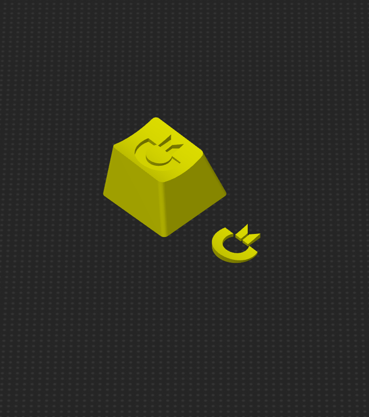

# Keycap with Commodore Logo and Cherry MX Stem in OEM Profile

The `.3mf` files are for Prusa Slicer and an Artillery Sidewinder X2.

The `.stl` files are in the [stl](stl) folder.

I printed them using Prusa Slicer on an Artillery Sidewinder X2 with a 0.4mm nozzle. A finer nozzle would yield better results. The inlay was printed with a 0.08mm layer height, while the key body has a variable layer height (0.08mm at the top part where the logo is and 0.2mm for the rest).

The stem is a bit recessed. So you need to support it (but only the base of the stem, not the whole inside).

This key fits perfectly on a Razer Blackwidow keyboard. You can customize and create your own key with OpenSCAD. Check out the [openscad](openscad/) folder.

  
  
  
  

