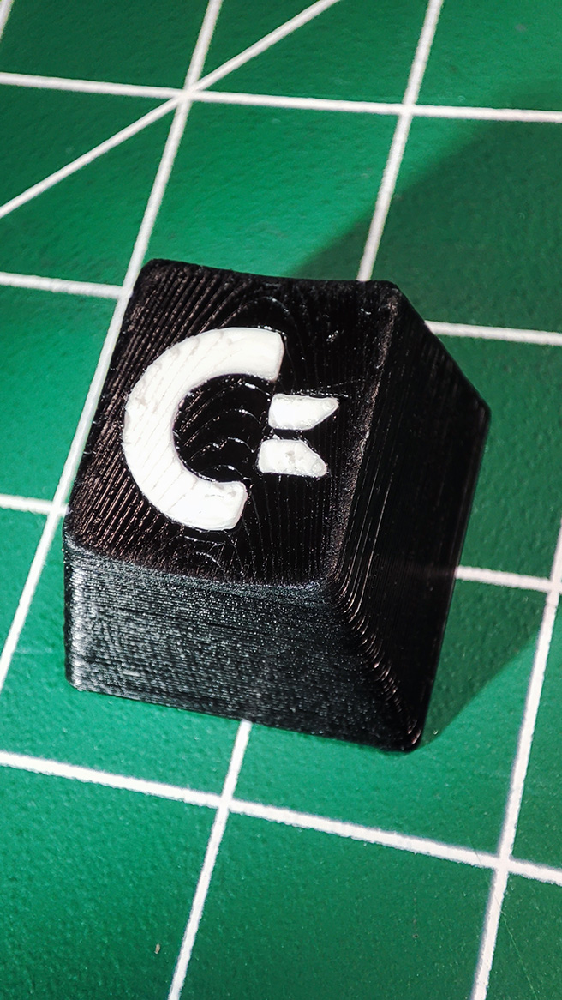
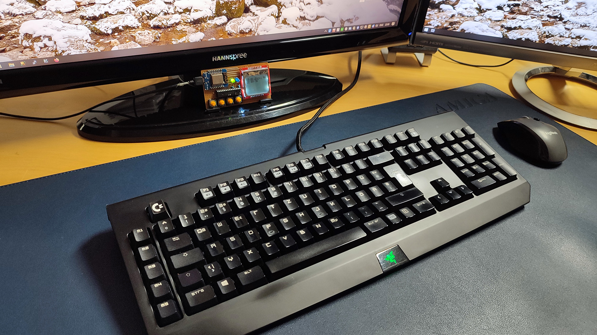

# Keycap with Commodore Logo with Cherry MX Stem in OEM Profile

The `.3mf` files are for Prusa Slicer and an Artillery Sidewinder X2.

The `.stl`  files are in the stl folder.

This is a key that is the same as the ESC key on a Razer Blackwidow keyboard. You can customize and create your own key with OpenSCAD. Check out the [README](openscad/readme.md).

