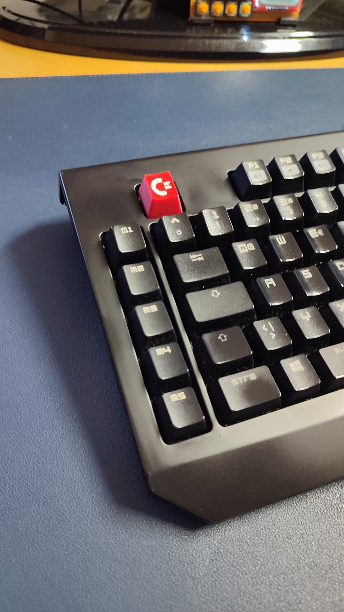

# Keycap with Commodore Logo and Cherry MX Stem in OEM Profile

The `.3mf` files are for Prusa Slicer and an Artillery Sidewinder X2.

The `.stl` files are in the [stl](stl) folder.

I printed them with Prusa Slicer on an Artillery Sidewinder X2. A 0.4mm nozzle was used. I think, finer would be better. The inlay was printed with 0.08mm layer hight. The key body with variable layer height (0.08mm at the top part where the logo is, and 0.2mm for the rest).

This is a key fits perfectly on a Razer Blackwidow keyboard. You can customize and create your own key with OpenSCAD. Check out the [README](openscad/readme.md).

  
  
  
  

